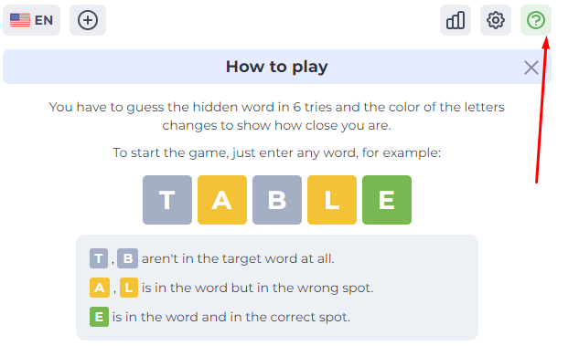
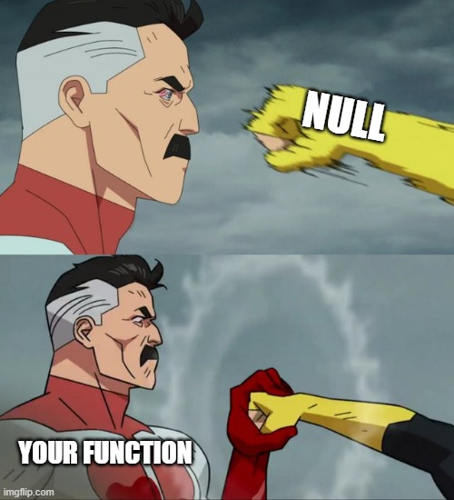

# Wordle game
Hey, as our practical task we'll implement a [Wordle Game](https://wordlegame.org/)

Go check it out if you don't know it - pretty fun game 🎉

## Part 1 - Logic
Making software is not only about coding

Usually it is a good idea to create programs this way:
- `analysis` - read and understand requirements
- `modeling` - describe a model (in TypeScript)
- `modeling` - create core functions and their signatures
- `testing` - write tests that describe the behavior of this model
- `implementation` - write code of the functions

So this is exactly how we'll proceed 👍

## Requirements
First go play the game
[Wordle Game](https://wordlegame.org/)

In the top-right corner you'll find the `(?)` - this will be our **specification** - read it carefully

We will not implement all functionality but only some of it

> For example we will NOT use other languages but English

Requirements for the first part are:
1. game should have **words of length 5**
2. number of **tries** should be **6**
3. only valid English words can be approved as guess
4. if guessed correctly - you win, incorrectly - show guess results according to game rules above ☝️
5. it should be possible to restart the game and play again

## Model and core functions
For this task we already described a model for you

Go check the following files in `src` folder
- `make-guess.ts` - describes core function of the game and it's signature
- `word-exists.ts` - function to check word validity
- `wordle-game.ts` - the game object description and it's API

Read the files and try to understand how it should work all together

## Tests
The tests for the these functions are in corresponding `*.spec.ts` files

Your task would be to fix all test

> This approach is called **test driven development** or TDD  
> TDD helps to think about how your code should work beforehand

### Positive and negative tests
When writing tests for a function try to break it as much as possible!

Yes - the function should do what it is supposed to do,
but sometimes users of this function might not know how exactly it is supposed to work.

So it's always a good practice to build **fault-tolerant** functions which will not break if you send `null` as 1st argument

### Corner cases
We've covered only **about 30%** of all possible cases.

There are "corner cases" nearly in each model, they can be tricky and should be handled.

Try to find all possible corner cases and write more tests that you find useful.

# Implementation
You can already start implementing the code of the core functions while thinking about / writing tests

Use the power of **TypeScript** and rely on compiler to reduce errors

⚠ Please **DO NOT** change the original model, unless you absolutely need to.
We will most rather rely on this model in future tasks

### Helpful Links
Use this [wordle solver](https://wordlegame.org/wordle-solver) to check your solutions

Also, the link to dictionary of [english words](https://github.com/lorenbrichter/Words/blob/master/Words/en.txt)